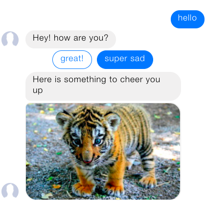

.. _quickstart:

Quickstart
==========

.. start-shared-content

This tutorial will show you the different parts needed to build a bot.
You can run the code directly here in the documentation without
installing anything, or you can install Rasa Core and run the examples in a Jupyter notebook
on your local machine! If you would like to run this locally, go to the :ref:`get_started_step3`
first to install the Rasa Stack.

.. contents:: The tutorial will include the following steps:

Goal
----
You will build a friendly chatbot which will ask you how you're doing
and send a you a fun picture to cheer you up if you are sad.

Teaching the bot to understand user inputs using Rasa NLU
---------------------------------------------------------

1. Create NLU examples
^^^^^^^^^^^^^^^^^^^^^^

You will start by teaching your assistant to understand your messages first.
For that, you will train the NLU model which will take your inputs in a simple
text format and extract structured data. This structured data, called intents,
will help the bot understand your message.

The first thing you will do is define the user messages your bot should
understand. You will achieve this by defining the intents and providing a few
ways users might express them.

Run the code cell below to save the Rasa NLU training examples to the file
``nlu.md``:

.. runnable::
   :description: core-write-nlu-data

   nlu_md = """
   ## intent:greet
   - hey
   - hello
   - hi
   - good morning
   - good evening
   - hey there

   ## intent:goodbye
   - bye
   - goodbye
   - see you around
   - see you later

   ## intent:mood_affirm
   - yes
   - indeed
   - of course
   - that sounds good
   - correct

   ## intent:mood_deny
   - no
   - never
   - I don't think so
   - don't like that
   - no way
   - not really

   ## intent:mood_great
   - perfect
   - very good
   - great
   - amazing
   - wonderful
   - I am feeling very good
   - I am great
   - I'm good

   ## intent:mood_unhappy
   - sad
   - very sad
   - unhappy
   - bad
   - very bad
   - awful
   - terrible
   - not very good
   - extremely sad
   - so sad
   """
   %store nlu_md > nlu.md

   print("The data has been successfully saved inside the nlu.md file! You can move on to the next step!")

2. Define the NLU model configuration
^^^^^^^^^^^^^^^^^^^^^^^^^^^^^^^^^^^^^

The NLU model configuration defines how the NLU model will be trained and how the
features from the text inputs will be extracted. In this example, you will use a
predefined ``tensorflow_embedding`` pipeline which you can learn more about
`here <https://rasa.com/docs/nlu/choosing_pipeline/>`_.

The code block below will save the NLU model configuration to the file called
``nlu_config.yml``.

.. runnable::
   :description: core-write-nlu-config

   nlu_config = """
   language: en
   pipeline: tensorflow_embedding
   """
   %store nlu_config > nlu_config.yml

   print("The configuration has been successfully stored inside the nlu_config.yml file. You can now move on to the next step!")

3. Train the NLU model
^^^^^^^^^^^^^^^^^^^^^^
Now you have all the components needed to train the NLU model. Run the cell below
which will call the rasa.nlu model, pass the previously defined ``nlu.md`` and
``nlu_config.yml`` files and save the model inside the ``models/current/nlu`` directory.

.. runnable::
   :description: core-train-nlu

   !python -m rasa_nlu.train -c nlu_config.yml --data nlu.md -o models --fixed_model_name nlu --project current --verbose

   print("The NLU model has been trained successfully! You can move to the next step!")

4. Test the model
^^^^^^^^^^^^^^^^^
Now, you can test the model to see if the bot can understand you. The code block
below will load the model which you just trained and return the intent classification
results for the message ``Hello``. You can test it on different messages as well,
by editing the ``Hello`` string:

.. runnable::
   :description: core-test-nlu

   from rasa_nlu.model import Metadata, Interpreter
   import json

   def pprint(o):
    # small helper to make dict dumps a bit prettier
       print(json.dumps(o, indent=2))

   interpreter = Interpreter.load('./models/current/nlu')
   pprint(interpreter.parse(u"Hello"))

Teaching the bot to respond using Rasa Core
-------------------------------------------

5. Write Stories
^^^^^^^^^^^^^^^^

At this stage, you will teach your chatbot to respond to your messages using Rasa Core.
Rasa Core will train the dialogue management
model and predict how the bot should respond at the specific state of the
conversation.

Rasa Core models learn from real conversational data in the form of training "stories".
A story is a real conversation between a user and a bot where user inputs are expressed
as intents and the responses of the bot are expressed as action names. Below is an example
of a simple conversation: the user says hello to our bot, and the bot says hello back.
This is how it looks as a story:

.. code-block:: story

   ## story1
   * greet
      - utter_greet

A story starts with ``##`` followed by a name (the name is optional).
lines that start with ``*`` are messages sent by the user.
Although you don't write the actual message, but rather
the intent that represents what the user `means`.
Lines that start with ``-`` are actions taken by your bot.
In this case, all of our actions are just messages sent back to the user,
like ``utter_greet``, but in general, an action can do anything,
including calling an API and interacting with the outside world.

Run the cell below to save the example stories inside the file called 'stories.md':

.. runnable::
   :description: core-write-stories

   stories_md = """
   ## happy path
   * greet
     - utter_greet
   * mood_great
     - utter_happy

   ## sad path 1
   * greet
     - utter_greet
   * mood_unhappy
     - utter_cheer_up
     - utter_did_that_help
   * mood_affirm
     - utter_happy

   ## sad path 2
   * greet
     - utter_greet
   * mood_unhappy
     - utter_cheer_up
     - utter_did_that_help
   * mood_deny
     - utter_goodbye

   ## say goodbye
   * goodbye
     - utter_goodbye
   """
   %store stories_md > stories.md

   print("The training stories have been successfully saved inside the stories.md file. You can move on to the next step!")

6. Define a Domain
^^^^^^^^^^^^^^^^^^

The next thing we need to do is define a ``Domain``.
The domain defines the universe your bot lives in - what user inputs it
should expect to get, what actions it should be able to predict, how to
respond and what information to store.
Here is an example domain for our bot which you'll write to a
file called ``domain.yml``:

.. runnable::
   :description: core-write-domain

   domain_yml = """
   intents:
     - greet
     - goodbye
     - mood_affirm
     - mood_deny
     - mood_great
     - mood_unhappy

   actions:
   - utter_greet
   - utter_cheer_up
   - utter_did_that_help
   - utter_happy
   - utter_goodbye

   templates:
     utter_greet:
     - text: "Hey! How are you?"

     utter_cheer_up:
     - text: "Here is something to cheer you up:"
       image: "https://i.imgur.com/nGF1K8f.jpg"

     utter_did_that_help:
     - text: "Did that help you?"

     utter_happy:
     - text: "Great carry on!"

     utter_goodbye:
     - text: "Bye"
   """
   %store domain_yml > domain.yml

   print("The domain has been successfully saved inside the domain.yml file. You can move on to the next step!")

So what do the different parts mean?

+---------------+-------------------------------------------------------------+
| ``intents``   | things you expect users to say. See                         |
|               | `Rasa NLU <https://rasa.com/docs/nlu/>`_                    |
+---------------+-------------------------------------------------------------+
| ``actions``   | things your bot can do and say                              |
+---------------+-------------------------------------------------------------+
| ``templates`` | template strings for the things your bot can say            |
+---------------+-------------------------------------------------------------+

**How does this fit together?**
Rasa Core's job is to choose the right action to execute at each step
of the conversation. Simple actions are just sending a message to a user.
These simple actions are the ``actions`` in the domain, which start
with ``utter_``. They will just respond with a message based on a template
from the ``templates`` section. See `Custom Actions <https://rasa.com/docs/core/customactions/>`_ for how to build
more interesting actions.

7. Train a Dialogue Model
^^^^^^^^^^^^^^^^^^^^^^^^^

The next step is to train a neural network on our example stories.
To do this, run the command below. This command will call the Rasa Core train
function, pass domain and stories files to it and store the trained model
into the ``models/dialogue`` directory. The output of this command will include
the training results for each training epoch.

.. runnable::
   :description: core-train-core

   !python -m rasa_core.train -d domain.yml -s stories.md -o models/dialogue

   print("Finished training! You can move on to the next step!")

8. Talk To Your Bot
^^^^^^^^^^^^^^^^^^^^^^

And that's it! You now have everything you need to start interacting with your bot!
Let's start up your full bot, including both Rasa Core and Rasa NLU models using
the commands below!

**This will not work if you haven't run the cells above!**

.. runnable::
   :description: core-chat-with-nlu

   import IPython
   from IPython.display import clear_output, HTML, display
   from rasa_core.agent import Agent
   from rasa_core.interpreter import RasaNLUInterpreter
   import time

   interpreter = RasaNLUInterpreter('models/current/nlu')
   messages = ["Hi! you can chat in this window. Type 'stop' to end the conversation."]
   agent = Agent.load('models/dialogue', interpreter=interpreter)

   def chatlogs_html(messages):
       messages_html = "".join(["&lt;p&gt;{}&lt;/p&gt;".format(m) for m in messages])
       chatbot_html = """&lt;div class="chat-window" {}&lt;/div&gt;""".format(messages_html)
       return chatbot_html

   while True:
       clear_output()
       display(HTML(chatlogs_html(messages)))
       time.sleep(0.3)
       a = input()
       messages.append(a)
       if a == 'stop':
           break
       responses = agent.handle_message(a)
       for r in responses:
           messages.append(r.get("text"))

Congratulations 🚀! You just built a bot from scratch,
powered entirely by machine learning.
Why not play around with the code above?

1. Teach your bot to understand you better. Add more NLU data, retrain the NLU model and restart your bot.
2. Add some more stories to provide more examples of how your bot should behave. Then retrain the Rasa Core model to try it!
3. Edit the response templates in the domain, retrain your model and see the results!

.. end-shared-content

There is a lot more you can do with Rasa Core, so go and read the sections
in the User Guide next.

.. raw:: html
   :file: poll.html

Bonus: Handle messages from Facebook
^^^^^^^^^^^^^^^^^^^^^^^^^^^^^^^^^^^^

If you want to handle input from Facebook instead of the command line, you can
specify that as part of the run command, after creating a credentials file
containing the information to connect to facebook. Let's put that
into ``credentials.yml``:

.. code-block:: yaml

  facebook:
    verify: "rasa-bot"
    secret: "3e34709d01ea89032asdebfe5a74518"
    page-access-token: "EAAbHPa7H9rEBAAuFk4Q3gPKbDedQnx4djJJ1JmQ7CAqO4iJKrQcNT0wtD"

If you are new to Facebook Messenger bots, head over to
:ref:`facebook_connector` for an explanation of the different values.

After setting that up, we can now run the bot using:

.. code-block:: bash

   python -m rasa_core.run -d models/dialogue -u models/nlu/current \
      --port 5002--credentials credentials.yml

and it will now handle messages users send to the Facebook page.

If you want to send buttons to the user like in the picture at the top of
this tutorial, update the ``utter_greet`` template in your domain to look like
this:

.. code-block:: yaml

   templates:
     utter_greet:
     - text: "Hey! How are you?"
       buttons:
       - title: "great"
         payload: "great"
       - title: "super sad"
         payload: "super sad"

.. include:: feedback.inc
